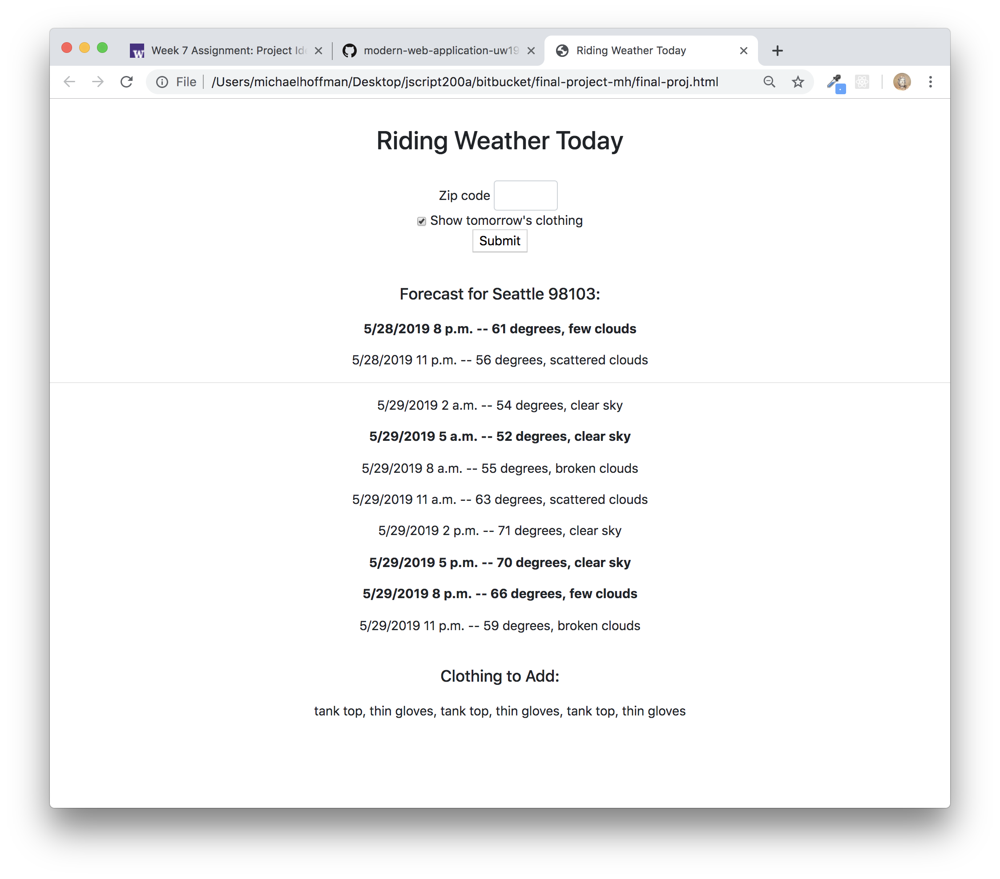

# Project Plan

Michael Hoffman

JSCRIPT300A, University of Washington

May 21, 2019

## Project name

Cycling Clothing Forecast

## Elevator pitch

This project is a React implementation of the project from the previous quarter.

Uses a Weather API, which returns weather forecasts for a given zip code in 3-hour increments.

Based on temperature and rain predicted, it recommends clothing for a morning, evening, and night ride.

The main usage scenario: around 5:00 am, run the app, and pack all of the weather-specific clothing that will be needed for the day, including the morning, rush hour, and night rides.

## Wireframes

The display depends on time of day.  An HR 

## Dependencies

### npm modules:

* create-react-app
* prop-types
* enzyme, enzyme-adapter-react-16, and enzyme-to-json
* react-router-dom
<!-- * react-test-renderer -->
<!-- * redux
* react-redux  -->

### APIs:

https://api.openweathermap.org

### Firebase: 

Store the clothing items needed for each weather condition.

## Task List

* Set up create-react-app.

* Call the API.

* Print the API results.

* Store the API results in React component state.

* Render the React state.

## Plan for each of 3 weeks

### Week 8

* Define the app.

* Display the raw data from the openweather API calls using React.

### Week 9

* Get the display to show appropriate information when running the app at various times of day. This proved to be the least straightforward part of the app design for the vanilla JavaScript version of the project.

* Style the data.  Separate the clothing items needed for morning, rush hour, and night.

### Week 10

* Define tests.

## Server Hosting

Host the app on Zeit's Now.
