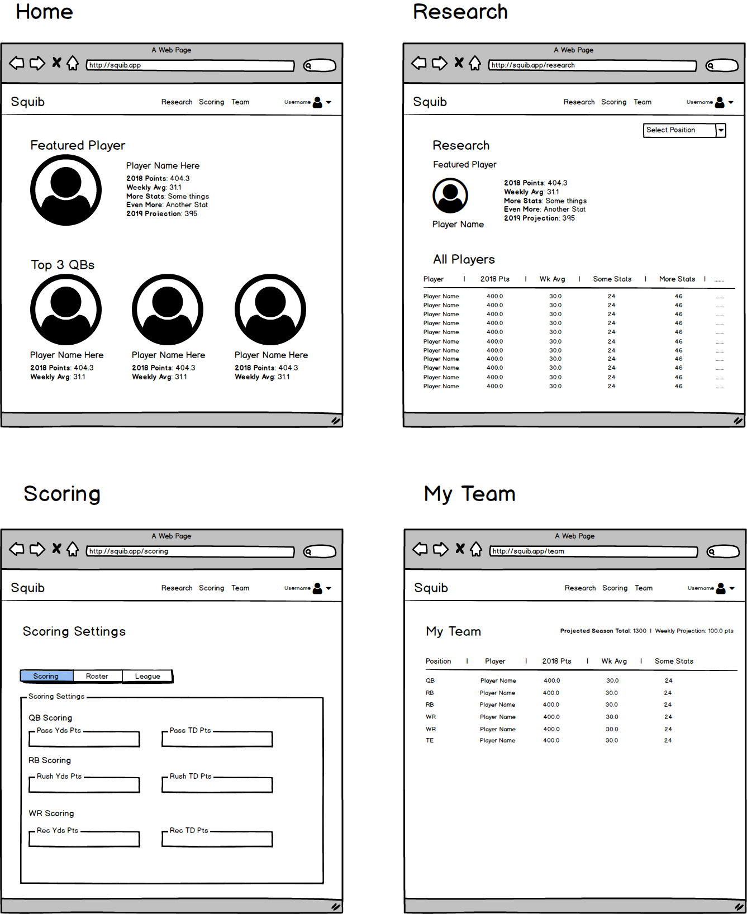

# Squib

A squib kick is a defensive maneuver in American Football to limit ability of the receiving team to return a kickoff for yardage. The Squib app is a tool for avid, statistics-driven fantasy football players to looking to gain an advantage in their upcoming draft. The app will serve as a source of truth for statistics on all NFL players and allow the user to input custom scoring parameters to compare players accross the league in order to strategize their draft plan. 

## Dependencies

- NFL API - This will be the source for player statistics. 
- Bootstrap - Used for laying out the app
- Redux — Used to store user data like custom scoring scenarios
- React Router - For page hierarchy 
- Firebase — Database for saving users and authorization

## Wireframe

## Task List

1. Initialization, dependency installation and build configuration
2. Server environment and deployment configuration
3. Create page routing and page hierarchy. 
4. Scaffold site by building static components of all functional areas of the app
5. Build redux store for handling state within the app
6. Integrate API calls for pulling dynamic data
7. (Nice to have) Implement auth and db through firebase (potentially use another DB service) to save settings
8. Style app

## Build Plan

### Week 1

- Initialize app 
- Server environment config
- Build page hierarchy with react router
- Begin build of static components

### Week 2

- Continue build of static components
- Build Redux Store
- Implement API calls
- Implement DB solution

### Week 3

- Implement authentication for new users
- Style the app