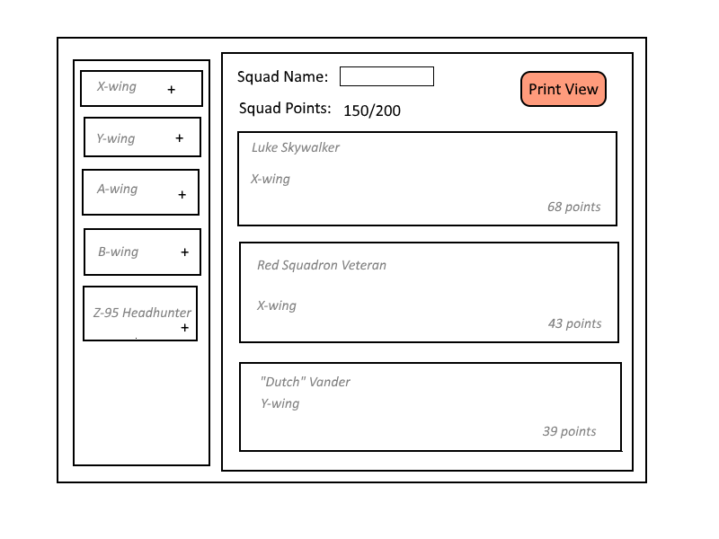

# Star Wars X-wing Squad Builder

This application will allow a player to create a squad for the [Star Wars X-Wing Second Edition](https://www.fantasyflightgames.com/en/products/x-wing-second-edition/) tabletop miniatures game. The player will be able to create a squad following all official squad building rules and print out a convenient squad list for use in tournaments.

## Scope Limitations

The rules for building a squad are fairly complex for the amount of time I have for this project, so I will be limiting the scope and leaving other features as stretch goals. Features I plan to implement include:

* Create a squad for the Rebel faction only
* Add ships to the squad
  * adding upgrades to ships will be a stretch goal
  * not all ships will be available
* Total squad points will be displayed and alert the user if the total goes above the allowable maximum of 200
* Once the user has finished selecting ships for the squad, the app will create a printer friendly output

## Dependencies

* React
* ZEIT for hosting

## Tasks

* Create json file with ship data
* Create component for displaying available ships from json file
* Create component for displaying selected ships and total squad points
* Create printer friendly output 
* Create tests
* Publish to ZEIT

## Plan

### Week 1

I will create the data file and the components for display and selection of ships.

### Week 2

I will create automated tests and publish the application to ZEIT.
Time permitting, I will create a printer friendly output format.

## Wireframe

